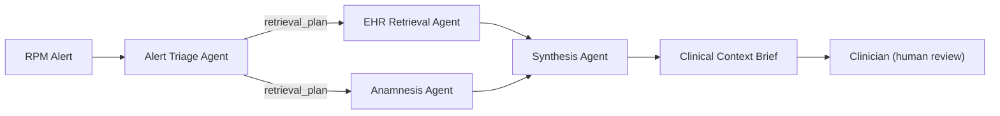
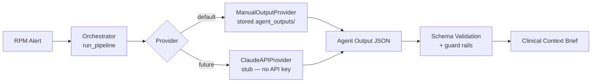

# ClinicalBridge: Bridging the Clinical Context Gap

> ## ⚠️ Important — read first
> - **All data in this repository is FICTIONAL.** No real patients, no real PHI.
> - **This is NOT a real clinical tool** and has **not** been clinically validated.
> - **The system does NOT make diagnoses.** It produces *factors to consider* only.
> - **Clinician review is ALWAYS required.** This is decision *support*, never a replacement for
>   clinical judgment.

**Project:** ClinicalBridge: Bridging the Clinical Context Gap  
**Course:** COP-3442 Prompt Engineering  
**University:** Bahçeşehir University  
**Department:** Artificial Intelligence Engineering Department  
**Professor:** Binnur Kurt  
**Group Members:**
- Kenan Eliyan — 2286181
- Rama Tamimi — 2285460
- Joud Wardeh — 2282493

> 📍 For a direct map of capstone requirements to repository files, see
> **[SUBMISSION_MAP.md](SUBMISSION_MAP.md)**.

---

## What this project is

ClinicalBridge is a proof-of-concept **multi-agent clinical decision-support prototype**. When a
Remote Patient Monitoring (RPM) device fires an alert, the system gathers the relevant Electronic
Health Record (EHR) and Anamnesis (patient-interview) context and produces a single **Clinical
Context Brief** — with every claim traceable to its source, uncertainty and missing data surfaced,
conflicts flagged, and no diagnosis made.

It addresses the **Clinical Context Gap**: an RPM alert ("BP 182/104") arrives as a bare number with
no story. ClinicalBridge assembles the story from data that already exists, flags what's missing, and
always cites its sources.

## The five components

| Component | Role |
|-----------|------|
| **Alert Triage Agent** | Judges urgency + validity; decides what context to pull |
| **EHR Retrieval Agent** | Selects only the EHR items relevant to the alert (verbatim, cited) |
| **Anamnesis Agent** | Extracts relevant patient-reported items; flags what wasn't collected |
| **Synthesis Agent** | Merges everything into the Clinical Context Brief (citations, conflicts, gaps, disclaimer) |
| **Orchestrator** | Sequences agents, validates every hand-off, runs safety guard rails |

Pipeline: **RPM alert → Triage → (EHR ‖ Anamnesis) → Synthesis → Clinical Context Brief → clinician**.

## Architecture Diagrams

A high-level view of the multi-agent system. The full set — data flow, provider design, prompt
iteration, and the evaluation pipeline — is in
[docs/09_architecture_diagrams.md](docs/09_architecture_diagrams.md).



---

## Installation

Requires Python 3.9+.

```bash
cd ClinicalBridge
pip install -r requirements.txt
```

The only hard dependency for the core pipeline (`main.py`) is `jsonschema`; the notebook additionally
uses `jupyter`. The **genuine LangChain RAG backend** for EHR retrieval (`langchain_pipeline/`) uses
`langchain`, `langchain-community`, `langchain-text-splitters`, `faiss-cpu`, and
`sentence-transformers` — all **local, no API key**. If they are not installed, EHR retrieval degrades
gracefully to the pure-Python TF-IDF fallback and the rest of the project still runs.

## How to run

### 1) Run the command-line app
```bash
python main.py                 # all scenarios + scorecard + a sample brief + adversarial safety tests
python main.py --brief 3       # print the full 8-section Clinical Context Brief for scenario 3
python main.py --scorecard     # just the evaluation scorecard
python main.py --adversarial   # just the adversarial safety tests
python main.py --demo 1        # clean step-by-step demo walkthrough (great for recording)
python main.py --demo 3 --save-transcript   # demo + save a Markdown transcript to outputs/
python main.py --rag-demo 1    # local TF-IDF RAG-style EHR retrieval + session-memory record (no API)
python main.py --langchain-rag-demo 1   # GENUINE LangChain RAG: Documents + FAISS + local embeddings
```
`main.py` runs the whole pipeline, validates every JSON hand-off against a schema, prints the
evaluation scorecard (including the **genuine LangChain retriever's Precision@5 / Recall@5**), renders
a sample brief, and runs the three adversarial safety tests. Exit code 0 means everything passed.

### 2) Run the notebook
```bash
jupyter notebook notebook/clinicalbridge_prototype.ipynb
```
Then **Restart & Run All**. The notebook imports the same `pipeline.py`, so the brief and scores match
the CLI exactly.

---

## Recording the Demo

Use the built-in **demo mode** for a clean, recordable, step-by-step walkthrough of one scenario —
the raw alert, each agent's output, the final 8-section brief, and the metrics — printed in pure
ASCII so it's readable in Windows PowerShell.

**Recommended scenarios: 1 (Missed Medication) and 3 (Silent Deterioration).**

```bash
python main.py --demo 1
python main.py --demo 3
python main.py --demo 1 --save-transcript   # writes outputs/demo_scenario_1_transcript.md
python main.py --demo 3 --save-transcript   # writes outputs/demo_scenario_3_transcript.md
```

**What the professor should see:** the raw RPM alert with no context, then each agent adding *cited*
context, then a Clinical Context Brief where every claim traces to a source — with **hallucination
rate 0.0** and **traceability 1.0** — and **no diagnosis**. A full speaking script is in
[docs/07_demo_walkthrough.md](docs/07_demo_walkthrough.md).

---

## What each folder contains

```
ClinicalBridge/
├── README.md                     # this file
├── main.py                       # command-line entry point
├── pipeline.py                   # shared core: load, orchestrate, validate, render brief; retrieval backend seam
├── langchain_pipeline/           # GENUINE LangChain RAG backend (Documents + splitter + embeddings + FAISS + retriever)
│   ├── ehr_loader.py             #   EHR records -> LangChain Document objects (with metadata)
│   ├── vector_store.py           #   local embeddings (all-MiniLM-L6-v2) + FAISS (graceful fallbacks)
│   ├── retriever.py              #   configurable top-k retriever (+ similarity scores)
│   └── rag_pipeline.py           #   end-to-end load->split->embed->index->retrieve pipeline
├── rag_retrieval.py              # local TF-IDF EHR retrieval (pure-Python, no API) — documented fallback backend
├── session_memory.py             # session-level audit memory writer
├── tools.py                      # agent tool wrappers (validate, retrieve, consistency, traceability)
├── memory/
│   └── session_memory.json       # audit log populated by --rag-demo
├── requirements.txt
├── ADVERSARIAL_TESTS.md          # 3 safety tests (missing value, ID conflict, vague symptom)
├── data/
│   └── patients.json             # 10 fictional patients (EHR + RPM + anamnesis)
├── schemas/                      # 7 JSON Schemas (inputs, agent outputs, final brief)
├── scenarios/                    # 5 self-contained scenarios + gold-standard briefs
├── agent_outputs/                # stored manual Claude outputs per scenario (the no-API data)
├── adversarial/                  # fixtures for the safety tests
├── outputs/                      # generated demo transcripts (created by --save-transcript)
├── prompts/                      # system prompts: v1/v2/v3 + changelog per agent
├── evaluation/
│   ├── metrics.py                # the 7-metric scoring code
│   └── README.md
├── notebook/
│   └── clinicalbridge_prototype.ipynb
├── docs/                         # design docs (objective, agents, orchestrator, eval, plan, demo, portfolio)
└── reports/                      # submission package:
    ├── final_project_report.md
    ├── prompt_engineering_portfolio.md
    └── evaluation_report.md
```

---

## How to use Claude manually (no API)

This prototype runs **without any API**. Agent outputs are generated by hand in the Claude app and
stored as JSON, then replayed by `pipeline.py`. To (re)generate an agent's output:

1. Open the agent's production prompt, e.g. `prompts/synthesis_agent/v3.md`, and copy it.
2. Open a scenario, e.g. `scenarios/scenario_1_missed_medication.json`, and copy the relevant input
   (for synthesis, the triage/EHR/anamnesis outputs from `agent_outputs/scenario_1_outputs.json`).
3. Paste both into Claude and run it.
4. Copy Claude's JSON answer into `agent_outputs/scenario_1_outputs.json` under the right key
   (`triage` / `ehr` / `anamnesis` / `brief`).
5. Re-run `python main.py` — it re-validates and re-scores automatically.

The repo ships with gold-quality `agent_outputs/` so everything runs out of the box; regenerate any
block to demonstrate prompt iteration.

## Using Claude Without an API

For a complete, illustrated walkthrough of using Claude as the manual LLM engine — the execution
flow, step-by-step instructions, and a full Scenario 1 example across all four agents — see
**[MANUAL_CLAUDE_WORKFLOW.md](MANUAL_CLAUDE_WORKFLOW.md)**.

## API-ready design

ClinicalBridge is built so a real Claude API connection can be added later without reworking the
project:

- **Current mode is reproducible manual / mock mode.** Agent outputs are generated by hand in Claude
  and replayed from `agent_outputs/`, so every run produces identical, gradeable results.
- **A provider abstraction makes future API integration simple.** The orchestrator runs every agent
  through a *provider* (in `pipeline.py`): the default `ManualOutputProvider` loads stored outputs,
  and a stubbed `ClaudeAPIProvider` marks exactly where a live call would go.
- **No API key is needed for the submitted prototype.** `ClaudeAPIProvider` is a safe placeholder
  that raises a clear message and requires no `anthropic` package and no network access.



## RAG, memory, and tools

The EHR Retrieval backend is a **genuine LangChain RAG pipeline** with local embeddings — no API key,
fully reproducible — and a documented pure-Python fallback so the project never breaks:

- **Genuine LangChain RAG** — [`langchain_pipeline/`](langchain_pipeline): loads every EHR record into
  LangChain `Document` objects, chunks them with `RecursiveCharacterTextSplitter`, embeds them with
  **`sentence-transformers/all-MiniLM-L6-v2`** (local, via `langchain-huggingface`), indexes them in a
  **FAISS** vector store, and serves a configurable top-k retriever (default `k=5`). The retrieved
  Documents become the grounding context for the EHR Retrieval Agent. Try it:
  `python main.py --langchain-rag-demo 1` (prints the pipeline config, the clinical question, the
  retrieved LangChain Documents with metadata + source IDs + FAISS similarity scores, and
  Precision@5 / Recall@5 against the gold relevant facts). If `sentence-transformers`/FAISS are
  unavailable it falls back to local `FakeEmbeddings`/in-memory store; if the whole LangChain stack is
  absent it falls back to the TF-IDF retriever below.
- **Local TF-IDF RAG (documented fallback)** — [`rag_retrieval.py`](rag_retrieval.py): chunks EHR items
  (each with a `source_id`), builds a pure-Python TF-IDF index, and retrieves top-k chunks for a
  clinical question. Try it: `python main.py --rag-demo 1`. This is the no-dependency backend the
  project degrades to when LangChain is not installed.
- **Session memory** — [`session_memory.py`](session_memory.py) → [`memory/session_memory.json`](memory/session_memory.json):
  a session-level *audit* log (scenario id, patient id, triage urgency, retrieved source ids, brief id).
  Not long-term clinical memory.
- **Tools** — [`tools.py`](tools.py): four documented tool wrappers (schema validation, EHR retrieval,
  patient-consistency check, traceability check).

> The LangChain RAG backend is real (genuine `Document` objects, `RecursiveCharacterTextSplitter`,
> local HuggingFace embeddings, FAISS, and a LangChain retriever) and requires **no external API
> keys**. The four-agent orchestration still runs in **no-API stored-output mode**; LangChain replaces
> only the EHR *retrieval backend*, behind an abstraction, so nothing else changes.

## How this could later connect to the Claude API

The design has a **single seam** to a live model: the agent **provider** in `pipeline.py`. In no-API
mode the default `ManualOutputProvider` reads a stored output; to go live, implement
`ClaudeAPIProvider.run_agent()` to send the agent's v3 prompt + context to Claude and return the
model's JSON, then pass `provider=ClaudeAPIProvider()` to `run_pipeline()`. **Nothing else changes** —
orchestration, schema validation, guard rails, and evaluation all stay identical. (See
`docs/03_orchestrator_design.md` and [MANUAL_CLAUDE_WORKFLOW.md](MANUAL_CLAUDE_WORKFLOW.md).)

---

## The Clinical Context Brief (8 sections)

Every brief is rendered with these sections (see `pipeline.render_brief`):
**1. Alert Summary · 2. Patient Snapshot · 3. Contextual Analysis · 4. Risk Assessment ·
5. Recommended Actions (not orders) · 6. Uncertainties and Gaps · 7. Sources Used · 8. Safety
Disclaimer.**

## Capstone-brief alignment

Additional alignment with the official COP-3442 brief:
- **Few-shot examples** (≥3 per agent, incl. an edge case) — `reports/prompt_engineering_portfolio.md`.
- **Official urgency taxonomy** (Critical/Urgent/Routine/Informational) mapped from the internal enum;
  shown in every brief's Risk Assessment (`pipeline.official_urgency`).
- **Critical-alert escalation** — `emergent` → Critical triggers an immediate, no-treatment escalation
  banner (`pipeline.is_critical` / `escalation_notice`); demonstrated by `python main.py`.
- **Bias Awareness** and **expanded References** sections — `reports/final_project_report.md`.
- **Model Parameter Rationale** (temperature/determinism) — `reports/prompt_engineering_portfolio.md`.

## Reading order for graders

1. `reports/final_project_report.md` — the full report
2. `reports/prompt_engineering_portfolio.md` — the v1→v3 prompt work
3. `reports/evaluation_report.md` — realistic results, failure cases, limitations
4. `ADVERSARIAL_TESTS.md` — safe-failure behavior
5. `docs/07_demo_walkthrough.md` — the live demo script

> **Reflection, lessons learned, and limitations** are documented in
> [reports/final_project_report.md](reports/final_project_report.md) (see "Reflection and Lessons
> Learned" and "Ethical Considerations and Limitations"). The **adversarial evaluation** — what each
> safety test checks and how the system fails safely — is documented in
> [ADVERSARIAL_TESTS.md](ADVERSARIAL_TESTS.md) and
> [reports/evaluation_report.md](reports/evaluation_report.md).

**PDF versions for submission.** Print-ready PDFs of the reports are included alongside the Markdown:
`reports/final_project_report.pdf`, `reports/prompt_engineering_portfolio.pdf`,
`reports/evaluation_report.pdf`, and `SUBMISSION_MAP.pdf`. The Markdown remains the source of truth;
the matching `.html` files can be re-printed via **Print → Save as PDF** in any browser.

## Safety stance (whole system)

No diagnoses · no real data · traceability mandatory · uncertainty surfaced, not hidden ·
human-in-the-loop. ClinicalBridge supports clinician review; it never replaces clinical judgment.
