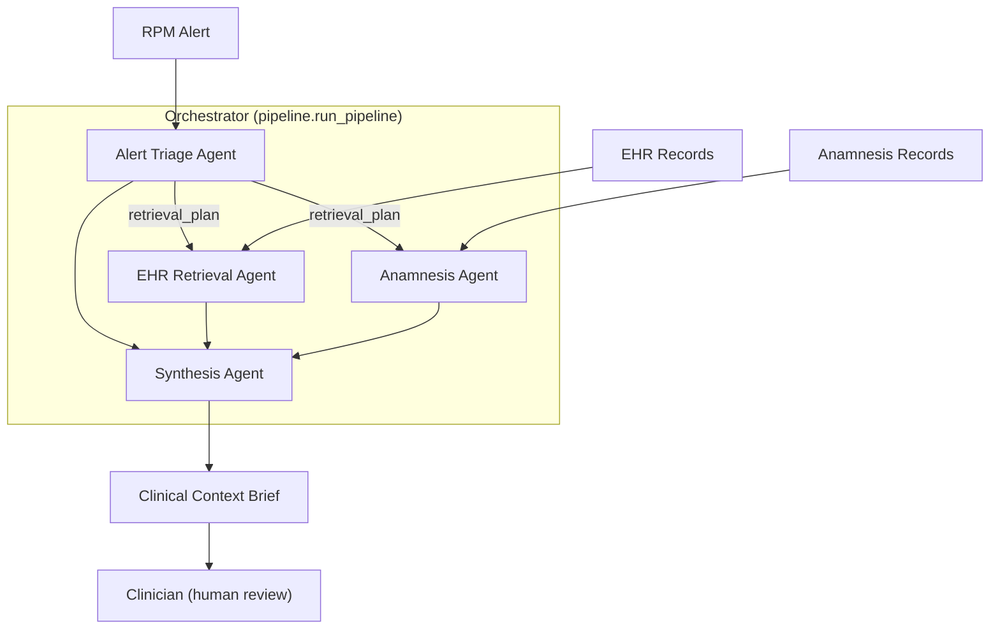
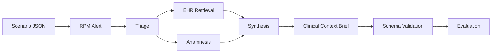
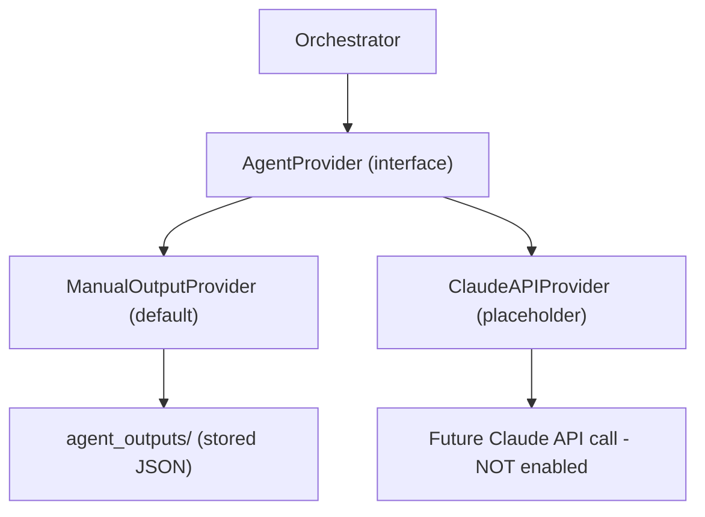
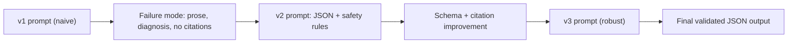
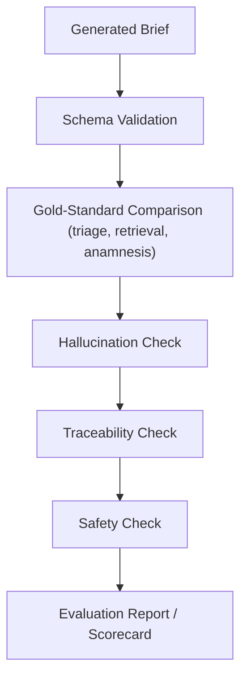

# 09 — Architecture Diagrams

> **Educational prototype. Fictional data only. Not a clinical tool. No diagnoses. Clinician review
> always required.**

These diagrams use [Mermaid](https://mermaid.js.org/), which renders automatically on GitHub and in
most Markdown viewers (and in VS Code with a Mermaid extension). They are documentation only — they
describe the system already implemented in [`pipeline.py`](../pipeline.py),
[`main.py`](../main.py), and [`evaluation/metrics.py`](../evaluation/metrics.py).

Contents:
- [A. High-Level System Architecture](#a-high-level-system-architecture)
- [B. End-to-End Data Flow](#b-end-to-end-data-flow)
- [C. Provider Design (API-ready)](#c-provider-design-api-ready)
- [D. Prompt Engineering Iteration Flow](#d-prompt-engineering-iteration-flow)
- [E. Evaluation Pipeline](#e-evaluation-pipeline)

---

## A. High-Level System Architecture

The four specialized agents are coordinated by the orchestrator. Triage runs first and produces a
`retrieval_plan` that targets the two retrieval agents; Synthesis consumes all three structured
outputs to build the brief, which a clinician then reviews.

---

## B. End-to-End Data Flow

How one scenario moves through the system, including the parallel retrieval stage and the
validation + evaluation that follow the brief.

---

## C. Provider Design (API-ready)

The orchestrator never talks to a model directly — it calls a *provider*. The default provider
replays stored manual Claude outputs; a future provider would call the real Claude API. Swapping the
provider is the only change needed to go live (no API key is required for the prototype).

---

## D. Prompt Engineering Iteration Flow

Each agent's prompt was iterated through three versions. v1 exposes failure modes (prose,
diagnosis-as-fact, no citations); v2 adds JSON + safety; v3 adds the schema/citation discipline that
produces final validated output. See [`reports/prompt_engineering_portfolio.md`](../reports/prompt_engineering_portfolio.md).

---

## E. Evaluation Pipeline

A generated brief is validated, compared to the gold standard, then checked for hallucination,
traceability, and safety before the scorecard is produced. Implemented in
[`evaluation/metrics.py`](../evaluation/metrics.py).

---

## See also
- [`02_agent_design.md`](02_agent_design.md) — what each agent does.
- [`03_orchestrator_design.md`](03_orchestrator_design.md) — control flow + the provider seam.
- [`04_evaluation_framework.md`](04_evaluation_framework.md) — the seven metrics in detail.
